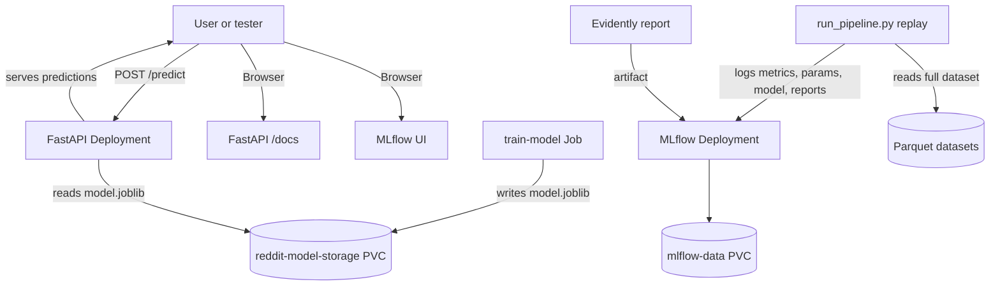

# Reddit Popularity MLOps Project

## Overview

This project is a small end-to-end MLOps case study built around a simple question:

> Can we predict whether a Reddit post is likely to become popular, and can we operate that model in a way that looks closer to a real production system than a notebook?

The project started as a local machine learning workflow with notebooks, Python scripts, MLflow, and drift detection. It has now been extended with:

- a FastAPI inference service
- a Kubernetes deployment for local practice on Docker Desktop Kubernetes
- a separate Kubernetes `Job` for model training
- an MLflow server running in Kubernetes

The goal is not to build a large-scale production platform. The goal is to create a realistic, interview-friendly system that demonstrates:

- supervised model training
- feature engineering
- offline evaluation
- drift detection
- retraining decisions
- experiment tracking
- containerization
- Kubernetes workload separation

## Problem Statement

Imagine an internal tool used by moderators, editors, or content teams:

> A user drafts a Reddit-style post. Before publishing, the system predicts how likely the post is to be "popular" based on its title and metadata.

This creates a practical MLOps problem:

- the model must be trained on historical data
- the model must be served through an API
- the serving system should not retrain itself every time it starts
- incoming data can shift over time
- we need a way to detect that shift
- if the shift is meaningful, we may want to retrain
- we need to track runs, metrics, and artifacts

That is the system this repository implements.

## What the Project Does

At a high level, the project has two sides:

1. an offline pipeline for training, replay, evaluation, and drift detection
2. an online serving layer for prediction

### Offline side

The Python scripts in [`src/`](/Users/nina/Desktop/py/projects/reddit/src) do the following:

- [`train.py`](/Users/nina/Desktop/py/projects/reddit/src/train.py)
  - loads historical Reddit post data
  - engineers features
  - defines the target label
  - trains a logistic regression classifier
  - saves a model and metrics

- [`drift.py`](/Users/nina/Desktop/py/projects/reddit/src/drift.py)
  - compares historical data to a later monitoring window
  - computes hand-built drift statistics
  - decides whether the model should be retrained

- [`evaluate.py`](/Users/nina/Desktop/py/projects/reddit/src/evaluate.py)
  - loads a saved run
  - evaluates performance on a chosen time window

- [`run_pipeline.py`](/Users/nina/Desktop/py/projects/reddit/src/run_pipeline.py)
  - simulates a live environment
  - trains on historical data
  - monitors a partial 2017 window
  - checks drift
  - retrains if necessary
  - evaluates on the remainder of 2017
  - logs metrics and artifacts to MLflow
  - generates an Evidently HTML drift report

### Online side

- [`api.py`](/Users/nina/Desktop/py/projects/reddit/src/api.py)
  - provides a FastAPI service
  - exposes `/health`, `/ready`, `/model/info`, and `/predict`
  - loads the trained model and predicts the probability of popularity for a new post payload

- [`train_serving_model.py`](/Users/nina/Desktop/py/projects/reddit/src/train_serving_model.py)
  - trains the model used by the FastAPI service
  - uses historical data only
  - writes `model.joblib` and metadata to a shared volume

## Data

The repository includes parquet datasets:

- [`posts-to-2016.parquet`](/Users/nina/Desktop/py/projects/reddit/posts-to-2016.parquet)
- [`posts-2017.parquet`](/Users/nina/Desktop/py/projects/reddit/posts-2017.parquet)

There is also a processed dataset path used by the replay pipeline:

- [`src/data/processed/posts.parquet`](/Users/nina/Desktop/py/projects/reddit/src/data/processed/posts.parquet)

### What is Parquet?

Parquet is a columnar file format for tabular data.

Compared with CSV:

- it is usually smaller
- it is usually faster to read for analytics/ML workloads
- it preserves data types better

In this project, parquet files are just structured datasets of Reddit posts that `pandas` can load directly with `read_parquet()`.

### Where the data goes

There are a few different data paths in this project, and they serve different purposes.

- raw or intermediate local files live in the repository
- training and replay scripts read parquet datasets from the repository
- serving model artifacts are written to a Kubernetes PVC
- MLflow metadata and MLflow artifacts are written to a separate Kubernetes PVC

More concretely:

- historical and replay input data
  - [`posts-to-2016.parquet`](/Users/nina/Desktop/py/projects/reddit/posts-to-2016.parquet)
  - [`posts-2017.parquet`](/Users/nina/Desktop/py/projects/reddit/posts-2017.parquet)
  - [`src/data/processed/posts.parquet`](/Users/nina/Desktop/py/projects/reddit/src/data/processed/posts.parquet)

- serving model output
  - `/models/model.joblib` inside the API and training containers
  - backed by the Kubernetes PVC `reddit-model-storage`

- MLflow backend and artifacts
  - `/mlflow/mlflow.db`
  - `/mlflow/artifacts`
  - backed by the Kubernetes PVC `mlflow-data`

- local script outputs
  - `artifacts/...` or `src/artifacts/...` from replay/training scripts
  - JSON summaries
  - parquet snapshots
  - drift HTML files

This separation matters because not all files belong to the same lifecycle:

- datasets are input data
- model files are deployable outputs
- MLflow files are tracking infrastructure state
- local artifacts are run outputs for analysis

### Time split

This project uses time as the core organizing principle:

- data up to and including 2016 is treated as historical reference data
- data in 2017 is treated as incoming or live data

That split is important because it lets the project simulate a realistic production question:

> If I trained on the past, what happens when new data starts arriving later?

## Target Label

The target is whether a post is "popular".

This is defined in [`train.py`](/Users/nina/Desktop/py/projects/reddit/src/train.py) by:

- taking the `utt_score` distribution on rows with year `<= train_end_year`
- computing the 90th percentile threshold
- labeling all rows as:
  - `1` if `utt_score >= threshold`
  - `0` otherwise

### Why define the label this way?

Because it creates a stable historical definition of popularity.

If the threshold were recomputed separately on 2017 data, then the meaning of "popular" would shift over time. That would make historical-to-live comparisons less meaningful.

By fixing the threshold from the historical window, the project keeps the label definition anchored to the training period.

## Features

Feature engineering is implemented in [`train.py`](/Users/nina/Desktop/py/projects/reddit/src/train.py).

### Raw input fields used

- `conv_title`
- `created_datetime`
- `conv_author_flair_text`
- `utt_score` for offline labeling only

### Engineered features

- `title_len`
- `hour`
- `day_of_week`
- `has_question_mark`
- `hour_sin`
- `hour_cos`
- `title_len_log`
- `universe_tag`
- `conv_author_flair_text`

### Text features

The model also uses:

- word-level TF-IDF features
- character n-gram TF-IDF features

### Why these features?

They are intentionally simple and interpretable:

- title text often carries the most predictive signal
- posting time can influence visibility and engagement
- title style and structure may correlate with performance
- flair and universe tags provide useful categorical context

This keeps the project understandable and easy to explain in an interview.

## Model

The model is a scikit-learn logistic regression classifier built in [`train.py`](/Users/nina/Desktop/py/projects/reddit/src/train.py).

### Why logistic regression?

Because for this project it is a good tradeoff:

- simple
- fast to train
- stable
- easy to debug
- strong baseline for sparse text features

A more complex model could improve performance, but would add operational and explanation complexity without adding much value for this learning goal.

## Metrics

The project uses:

- PR-AUC
- ROC-AUC
- positive class rate

### Why PR-AUC?

This is the more important metric here because the positive class is relatively rare. A model can look decent on ROC-AUC even when it is not especially strong at identifying rare positive examples.

### Why ROC-AUC too?

Because it is still a useful general ranking metric and helps compare behavior across runs.

## Drift Detection

Drift detection is implemented in [`drift.py`](/Users/nina/Desktop/py/projects/reddit/src/drift.py) and reused in [`run_pipeline.py`](/Users/nina/Desktop/py/projects/reddit/src/run_pipeline.py).

The drift logic compares historical reference data against a monitoring window from 2017.

### Drift signals used

1. `title_len_log` mean shift
2. hour-of-day distribution drift using total variation distance
3. question mark rate shift
4. prediction score distribution drift using a KS-style statistic

### Why these signals?

They are all available before labels are known.

That matters in realistic monitoring:

- labels often arrive late or are incomplete
- you still need some early warning signals

So this project uses pre-label drift signals:

- feature distribution changes
- model score distribution changes

### Drift thresholds

The code uses simple threshold rules:

- `title_len_mean_shift_z > 0.25`
- `hour_tvd > 0.10`
- `question_rate_abs_shift > 0.03`
- `score_ks > 0.10`

If any threshold is exceeded, `should_retrain = true`.

### Why threshold-based rules instead of a more advanced approach?

Because this is a small, explainable system. In interviews, simple policies are often better than complicated ones if you can justify them clearly.

This lets you say:

> We used interpretable drift checks as operational policy knobs, and if any of them crossed a threshold, we retrained.

## Retraining Logic

The replay pipeline in [`run_pipeline.py`](/Users/nina/Desktop/py/projects/reddit/src/run_pipeline.py) simulates a live deployment.

Example:

- train baseline on data up to 2016
- choose an `--as-of` date such as `2017-03-31`
- use 2017 data up to March 31 as the monitoring window
- check drift
- if drift is high, retrain using historical data plus that monitoring window
- evaluate on the remaining future part of 2017

### Why this is useful

This creates a concrete, realistic workflow:

- model deployed on historical data
- new data arrives
- detect whether the world changed
- update the model if needed
- measure whether that helped

That is much closer to a real MLOps problem than simply training once and reporting one validation score.

## MLflow

MLflow is used for experiment tracking.

In this project it stores:

- run parameters
- metrics
- model artifacts
- the Evidently HTML report

### What MLflow gives us

- a UI to compare runs
- a place to store models and artifacts
- a record of what configuration produced which result

This is especially useful when replaying different 2017 checkpoints such as:

- March 31
- June 30
- September 30

Each of those can be a separate run in the same experiment.

## Evidently

Evidently is used to generate a visual drift report.

The report complements the custom drift logic:

- custom drift logic drives the retraining decision
- Evidently provides a richer HTML artifact for inspection

### Why both?

Because they serve different purposes:

- the custom logic is small and explicit, good for decision-making
- Evidently is good for visualization and communication

## What the Project Looked Like Before

Originally, this project was closer to a notebook-plus-scripts workflow:

- notebooks explored the data and model
- Python scripts handled training and replay
- MLflow was used locally
- the deployment path was manual

There was also a GCP version of the setup where:

- project files were copied to a Compute Engine VM
- MLflow ran on that VM
- GCS was used for artifact storage

### Why that GCP version was useful

It proved that the system could run outside a laptop and use cloud storage for artifacts.

### Why it was still limited

Because it was still basically a manually managed machine:

- training, serving, and tracking were not clearly separated as workloads
- deployment was operationally manual
- there was no Kubernetes-style distinction between long-running services and one-off batch jobs

That setup was a good first cloud step, but not yet a strong infrastructure story by itself.

## What We Changed Now

This repository was extended with a more structured local platform.

### New additions

- [`requirements.txt`](/Users/nina/Desktop/py/projects/reddit/requirements.txt)
  - makes dependencies explicit and reproducible

- [`Dockerfile`](/Users/nina/Desktop/py/projects/reddit/Dockerfile)
  - packages the application into a container image

- [`api.py`](/Users/nina/Desktop/py/projects/reddit/src/api.py)
  - adds a real serving layer

- [`train_serving_model.py`](/Users/nina/Desktop/py/projects/reddit/src/train_serving_model.py)
  - trains a serving model from historical data only

- Kubernetes manifests in [`k8s/`](/Users/nina/Desktop/py/projects/reddit/k8s)
  - namespace
  - model PVC
  - MLflow deployment
  - FastAPI deployment
  - model training job

### Why these changes matter

They turn the project from a script collection into a small platform with clear workload boundaries.

## Why Training Was Moved Out of the API Pod

At first, one easy approach was to train the model in an API `initContainer`. That works technically, but it is not a good operational design.

Problems with that approach:

- every pod restart retrains the model
- serving startup becomes slow
- serving depends on batch work
- it mixes two different workload lifecycles

So training was moved into a separate Kubernetes `Job`.

### Why that is better

- training is a batch workload that should run once and exit
- serving is a long-running workload that should stay available
- the API pod can focus only on prediction
- the model artifact becomes an explicit dependency

This is a more realistic use of Kubernetes.

## Why a Shared PVC Was Added

The training `Job` writes:

- `model.joblib`
- `model_metadata.json`

The FastAPI deployment reads those files.

The simplest local way to share them on Docker Desktop Kubernetes is a PersistentVolumeClaim.

### Why this makes sense here

- it is easy to reason about
- it works well on a single-node local cluster
- it avoids adding object storage complexity too early

In a larger system, object storage would likely be better. For this local practice setup, a PVC is the right tradeoff.

## Current Architecture



## Architecture Description

### Training path

- Kubernetes `Job` runs [`train_serving_model.py`](/Users/nina/Desktop/py/projects/reddit/src/train_serving_model.py)
- it reads historical parquet data
- it trains a logistic regression model
- it writes the model to the shared PVC

### Serving path

- FastAPI deployment starts
- it loads the trained model from the PVC
- `/ready` returns success only when the model exists
- `/predict` accepts a full post payload and computes the engineered features needed by the model

### Experiment path

- MLflow runs as its own deployment
- replay runs from [`run_pipeline.py`](/Users/nina/Desktop/py/projects/reddit/src/run_pipeline.py) log metrics and artifacts there
- Evidently reports are attached to MLflow runs

## How the Repository Is Organized

### Main directories and files

- [`src/`](/Users/nina/Desktop/py/projects/reddit/src)
  - training, replay, evaluation, drift, and API code

- [`k8s/`](/Users/nina/Desktop/py/projects/reddit/k8s)
  - Kubernetes manifests for local deployment

- [`data/`](/Users/nina/Desktop/py/projects/reddit/data)
  - CSV data files and other local assets

- [`posts-to-2016.parquet`](/Users/nina/Desktop/py/projects/reddit/posts-to-2016.parquet)
  - historical training data

- [`posts-2017.parquet`](/Users/nina/Desktop/py/projects/reddit/posts-2017.parquet)
  - later data used for monitoring/replay ideas

- [`requirements.txt`](/Users/nina/Desktop/py/projects/reddit/requirements.txt)
  - Python dependencies

- [`Dockerfile`](/Users/nina/Desktop/py/projects/reddit/Dockerfile)
  - image build

### File-by-file guide

#### Source code

- [`src/train.py`](/Users/nina/Desktop/py/projects/reddit/src/train.py)
  - main offline training script
  - defines the feature engineering, label creation, model pipeline, and metric reporting

- [`src/run_pipeline.py`](/Users/nina/Desktop/py/projects/reddit/src/run_pipeline.py)
  - replay pipeline
  - simulates training, monitoring, drift detection, retraining, future evaluation, and MLflow logging

- [`src/drift.py`](/Users/nina/Desktop/py/projects/reddit/src/drift.py)
  - standalone drift checker for comparing reference data against a later monitoring window

- [`src/evaluate.py`](/Users/nina/Desktop/py/projects/reddit/src/evaluate.py)
  - standalone evaluation script for a saved run directory

- [`src/api.py`](/Users/nina/Desktop/py/projects/reddit/src/api.py)
  - FastAPI serving layer
  - loads a model and exposes prediction and health endpoints

- [`src/train_serving_model.py`](/Users/nina/Desktop/py/projects/reddit/src/train_serving_model.py)
  - batch trainer for the serving model used by Kubernetes
  - trains from historical data only

#### Kubernetes files

- [`k8s/namespace.yaml`](/Users/nina/Desktop/py/projects/reddit/k8s/namespace.yaml)
  - creates the `reddit-ml` namespace

- [`k8s/model-storage.yaml`](/Users/nina/Desktop/py/projects/reddit/k8s/model-storage.yaml)
  - creates the PVC where the trained serving model is stored

- [`k8s/train-job.yaml`](/Users/nina/Desktop/py/projects/reddit/k8s/train-job.yaml)
  - creates the one-off Kubernetes `Job` that trains the serving model

- [`k8s/api.yaml`](/Users/nina/Desktop/py/projects/reddit/k8s/api.yaml)
  - creates the FastAPI `Deployment` and `Service`

- [`k8s/mlflow.yaml`](/Users/nina/Desktop/py/projects/reddit/k8s/mlflow.yaml)
  - creates the MLflow `Deployment`, `Service`, and PVC

#### Data files

- [`posts-to-2016.parquet`](/Users/nina/Desktop/py/projects/reddit/posts-to-2016.parquet)
  - historical reference data used for training

- [`posts-2017.parquet`](/Users/nina/Desktop/py/projects/reddit/posts-2017.parquet)
  - later data used to represent incoming or live data in replay scenarios

- [`src/data/processed/posts.parquet`](/Users/nina/Desktop/py/projects/reddit/src/data/processed/posts.parquet)
  - combined processed dataset used by `run_pipeline.py`

- [`data/*.csv`](/Users/nina/Desktop/py/projects/reddit/data)
  - local CSV source files related to the Reddit data preparation or analysis workflow

#### Tracking and generated artifacts

- [`mlflow.db`](/Users/nina/Desktop/py/projects/reddit/mlflow.db)
  - local SQLite database for MLflow from the earlier local setup
  - stores MLflow metadata such as experiments, runs, params, and metrics
  - it is not the same thing as model artifacts

- [`mlruns/`](/Users/nina/Desktop/py/projects/reddit/mlruns)
  - local MLflow artifact directory from the earlier local setup
  - may contain logged artifacts and run data from before the Kubernetes MLflow deployment

- [`drift_report.html`](/Users/nina/Desktop/py/projects/reddit/drift_report.html)
  - a generated Evidently HTML report from a prior run
  - not source code

- [`src/artifacts/`](/Users/nina/Desktop/py/projects/reddit/src/artifacts)
  - saved outputs from previous pipeline runs
  - may include models, config files, JSON metrics, and parquet snapshots

- image files such as screenshots in the repo root
  - examples: `mlflow-screen.png`, `evidently-report.png`, `gcp-bucket.png`
  - documentation/demo assets, not runtime files

- notebooks such as [`logregr.ipynb`](/Users/nina/Desktop/py/projects/reddit/logregr.ipynb) and [`new-data.ipynb`](/Users/nina/Desktop/py/projects/reddit/new-data.ipynb)
  - exploration and experimentation
  - useful context, but not the main operational path now

### What is `mlflow.db`?

`mlflow.db` is a SQLite database file used by MLflow as its backend store.

It stores tracking metadata such as:

- experiments
- run IDs
- params
- metrics
- tags
- artifact references

It does not usually store the actual large artifacts themselves.

Those artifacts are stored separately, for example:

- in `mlruns/` in a local file-based setup
- or in `/mlflow/artifacts` in the current Kubernetes setup
- or in GCS in the earlier GCP version

### Why keep `mlflow.db` at all?

For local development, SQLite is simple:

- no external database to manage
- easy to inspect
- enough for a small single-user setup

### Why not keep relying on local `mlflow.db` forever?

Because it is not ideal for a more realistic shared or durable environment:

- it is single-node and local
- not a good fit for multiple users or robust production operations
- harder to separate from the machine lifecycle

That is why in cloud or larger deployments people often use:

- PostgreSQL or MySQL for MLflow backend metadata
- object storage for artifacts

### Which files are source and which are generated?

It helps to distinguish between files you maintain and files the system produces.

Source files you edit:

- Python files in `src/`
- Kubernetes manifests in `k8s/`
- `requirements.txt`
- `Dockerfile`
- `README.md`

Generated files you usually should not treat as source of truth:

- `mlflow.db`
- `mlruns/`
- `drift_report.html`
- `src/artifacts/...`
- screenshots and exported report images
- notebook checkpoints

This distinction matters in interviews too, because it shows you understand:

- what is configuration
- what is application code
- what is persistent state
- what is generated output

## End-to-End Example Flow

Here is one concrete scenario.

### 1. Train the serving model

The Kubernetes `Job` trains a model using only historical data up to 2016.

Output:

- `model.joblib`
- metadata JSON

### 2. Serve predictions

A user sends a request like:

```json
{
  "conv_title": "[Marvel] Why did Doctor Strange do that?",
  "created_datetime": "2017-03-31T14:25:00",
  "conv_author_flair_text": "Earth-616",
  "post_id": "abc123",
  "subreddit": "AskScienceFiction",
  "body": "Optional for now"
}
```

The API:

- rebuilds the same engineered features used in training
- scores the post
- returns a popularity probability and predicted label

### 3. Monitor drift

Suppose we want to know what happened by `2017-03-31`.

The replay pipeline:

- trains the baseline on the historical window
- takes January through March 2017 as the monitoring window
- computes drift signals
- decides whether retraining is needed

### 4. Retrain if needed

If drift flags exceed thresholds, the pipeline retrains using:

- historical data
- plus the available 2017 monitoring window

### 5. Evaluate the decision

The pipeline then evaluates on the later 2017 window to see how the selected model performed after the decision point.

This is the key learning loop:

- observe change
- decide whether to retrain
- test whether that decision helped

## Current Kubernetes Workloads

### `reddit-api` Deployment

Purpose:

- long-running inference service

Why a `Deployment`:

- the API should stay available
- Kubernetes can restart it if it fails
- it supports readiness and liveness probes

### `train-model` Job

Purpose:

- one-off batch training of the serving model

Why a `Job`:

- training is finite work, not a continuously running service
- it should complete and exit

### `mlflow` Deployment

Purpose:

- experiment tracking UI and server

Why a `Deployment`:

- it is a continuously available service for logging and browsing runs

## Why This Design Makes Sense for Kubernetes Practice

Kubernetes is most useful when you have different workload types with different lifecycles.

This project now demonstrates that clearly:

- API serving: long-lived service
- training: batch job
- experiment tracking: platform service

That is a much better Kubernetes story than simply putting one Python script into one container.

## How to Run Locally

### Build the image

```bash
docker build -t reddit-api:local .
```

### Deploy Kubernetes resources

```bash
kubectl apply -f k8s/namespace.yaml
kubectl apply -f k8s/model-storage.yaml
kubectl apply -f k8s/mlflow.yaml
kubectl apply -f k8s/train-job.yaml
kubectl -n reddit-ml logs -f job/train-model
kubectl apply -f k8s/api.yaml
```

### Inspect with k9s

```bash
k9s -n reddit-ml
```

Useful checks:

- `:po` for pods
- `:svc` for services
- `:pvc` for persistent volume claims
- `l` for logs
- `d` for describe

### Port-forward the API

```bash
kubectl -n reddit-ml port-forward svc/reddit-api 8000:8000
```

FastAPI docs:

- `http://localhost:8000/docs`

### Port-forward MLflow

On macOS, port `5000` may already be used by an Apple service, so use `5001`:

```bash
kubectl -n reddit-ml port-forward svc/mlflow 5001:5000
```

MLflow UI:

- `http://localhost:5001`

## API Endpoints

### `/health`

Basic process-level health endpoint.

### `/ready`

Readiness endpoint. Returns success only when the model file exists.

### `/model/info`

Returns model metadata and feature names.

### `/predict`

Accepts a post payload and returns:

- probability of popularity
- predicted label
- engineered features used for inference

### Example request

```bash
curl -X POST http://localhost:8000/predict \
  -H "Content-Type: application/json" \
  -d '{
    "conv_title": "[Marvel] Why did Doctor Strange do that?",
    "created_datetime": "2017-03-31T14:25:00",
    "conv_author_flair_text": "Earth-616",
    "post_id": "abc123",
    "subreddit": "AskScienceFiction",
    "body": "Optional for now"
  }'
```

## Running Replay Experiments in MLflow

Use a new experiment name with the corrected MLflow artifact configuration:

```bash
python3 -m src.run_pipeline \
  --data src/data/processed/posts.parquet \
  --train_end_year 2016 \
  --live_year 2017 \
  --as-of 2017-03-31 \
  --tag replay_Mar31 \
  --mlflow-uri http://localhost:5001 \
  --experiment-name Reddit_Popularity_V2
```

Then compare runs for different dates:

```bash
python3 -m src.run_pipeline \
  --data src/data/processed/posts.parquet \
  --train_end_year 2016 \
  --live_year 2017 \
  --as-of 2017-06-30 \
  --tag replay_Jun30 \
  --mlflow-uri http://localhost:5001 \
  --experiment-name Reddit_Popularity_V2
```

```bash
python3 -m src.run_pipeline \
  --data src/data/processed/posts.parquet \
  --train_end_year 2016 \
  --live_year 2017 \
  --as-of 2017-09-30 \
  --tag replay_Sep30 \
  --mlflow-uri http://localhost:5001 \
  --experiment-name Reddit_Popularity_V2
```

### Why keep these in the same experiment?

Because they represent the same system under different replay dates. MLflow experiments should usually group comparable runs together.

## Limitations

This is still a small practice project, not a complete production platform.

Current limitations include:

- model artifacts for serving are stored on a PVC rather than object storage
- drift replay still runs manually from the local machine
- thresholds are hand-tuned rather than learned
- there is no CI/CD pipeline yet
- the serving API uses a single model file with no model registry promotion flow
- authentication and authorization are not implemented

## What Would Be a Good Next Step

The most natural next improvements would be:

1. add a Kubernetes `Job` or `CronJob` for drift replay
2. move serving model storage from PVC to object storage
3. add a model registry or explicit "promote model" step
4. add tests for feature engineering and API inference
5. add a small architecture slide or diagram for interview presentation

## Interview Framing

A concise interview summary for this project would be:

> I started with a notebook-style Reddit popularity model and turned it into a small MLOps system. Historical data through 2016 is used for training, 2017 is used to simulate live monitoring, drift is detected using feature and score-based signals, MLflow tracks runs and artifacts, Evidently provides visual drift reports, and the system now runs locally on Kubernetes with separate workloads for serving, training, and experiment tracking.

That is the main value of this repository: not just a model, but a model plus an operating story.
